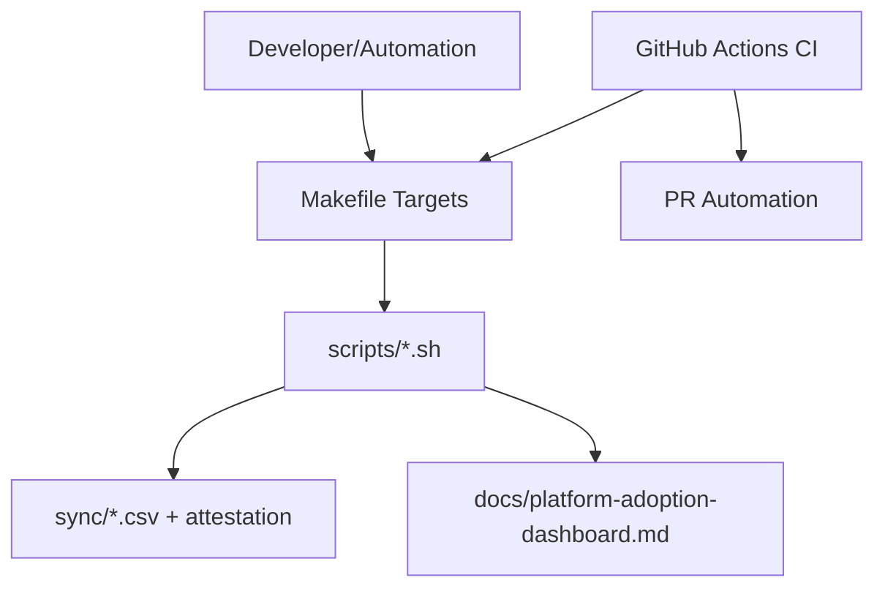

# معماری (استنباطی)

## لایه‌ها
1. **Orchestration Layer**: Makefile به‌عنوان ورودی یکپارچه.
2. **Execution Layer**: اسکریپت‌های Bash در `scripts/` و `platform/scripts/`.
3. **Reporting Layer**: تولید CSV/attestation و داشبورد markdown.
4. **CI/CD Layer**: اجرای pipeline و ایجاد PR برای بروزرسانی خروجی‌ها.

## جریان داده
- ورودی‌ها: `sync/targets*.yaml` و template policy.
- پردازش: divergence-report و validation.
- خروجی: CSVها، trend، attestation و داشبورد.
