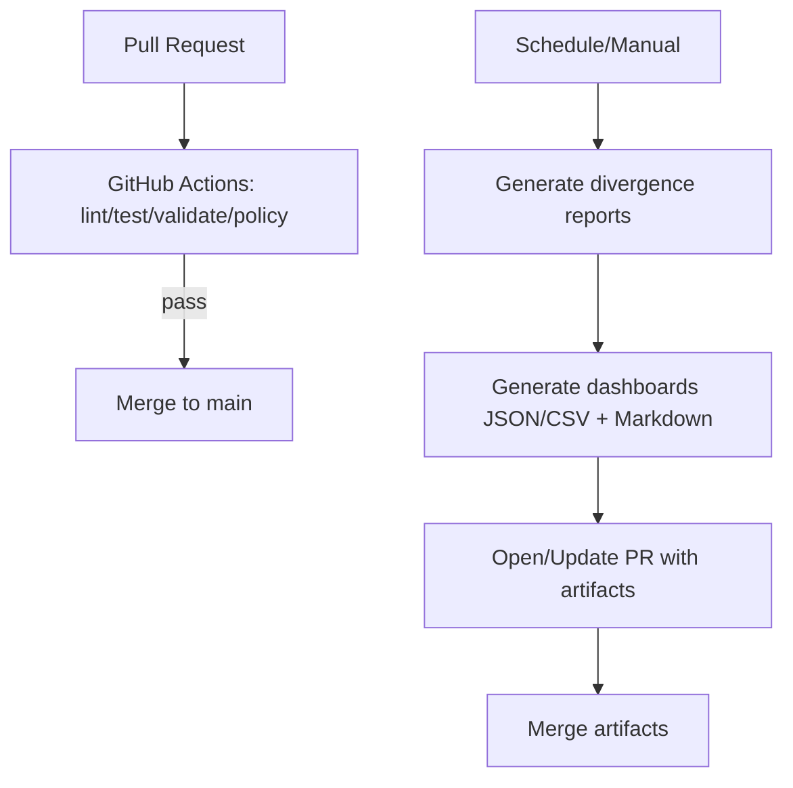
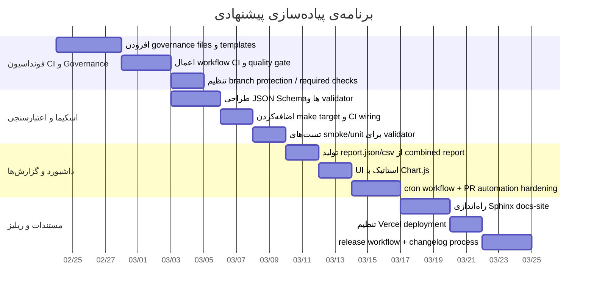
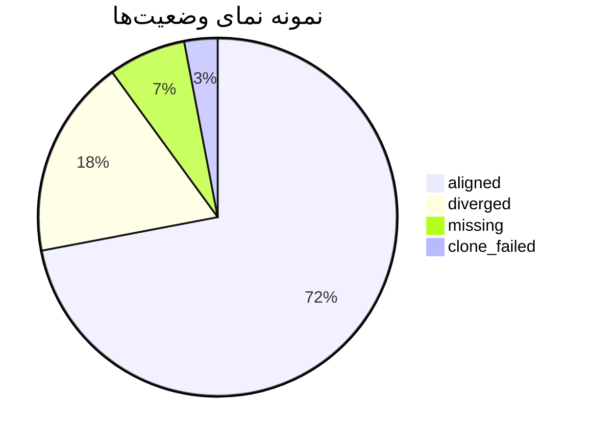

# بسته Production-ready برای ASDEV Standards Platform

## خلاصه مدیریتی

این deliverable یک بسته‌ی آماده‌ی «Production-ready» برای ریپوی **asdev-standards-platform** است که در یک commit/PR می‌تواند به تیم اجرایی تحویل داده شود. در وضعیت فعلی ریپو، شما زیرساخت‌های خوبی برای automation و گزارش‌گیری دارید (Make targets، divergence reports، و مستندات داشبورد مدیریتی). citeturn3view0turn18view0turn66view0 اما برای اینکه خروجی واقعاً production-grade شود، باید چند لایه‌ی حیاتی اضافه/تقویت شود: **Quality Gate الزام‌آور روی PR (lint/test/schema/policy)**، **اعتبارسنجی schema-driven برای YAMLها**، **فرآیند release استاندارد و اتومات (SemVer + GitHub Releases)**، **سایت Docs استاندارد با Sphinx (Django-like) و قابل Deploy روی Vercel**، و **داشبورد سبک انطباق با خروجی JSON/CSV**.

این بسته دقیقاً همین موارد را اضافه می‌کند:  
- GitHub Actions CI/CD که PRها را روی خطا fail می‌کند و schedule/cron برای تولید گزارش‌ها و آپدیت داشبورد دارد. citeturn25search2turn59search6  
- اسکیماهای JSON Schema (Draft 2020-12) + ابزار validate برای YAMLها با Make target و اتصال به CI. citeturn30search0turn55view0  
- ریلیز اتومات با `gh release create --generate-notes` و فرآیند bump نسخه مطابق SemVer. citeturn46view0turn62search0  
- سایت docs مبتنی بر Sphinx با theme پایدار و امکان CSS سفارشی برای نزدیک شدن به ظاهر Django docs. citeturn41view0turn54view0turn42view0  
- داشبورد انطباق سبک (HTML+Chart.js) که از `report.json/csv` مصرف می‌کند. citeturn57view0  

**فایل ZIP آماده برای Drop-in** (همراه با همه فایل‌ها) در همین پاسخ تولید شده است:  
[Download the package](sandbox:/mnt/data/ASDEV_Standards_Platform_Production_Ready_Package.zip)

## تحلیل وضعیت فعلی ریپو و شکاف‌های Production

**قراردادهای اصلی داده در ریپو** همین حالا مشخص است: `sync/targets.yaml`/`sync/targets*.yaml` تعریف می‌کند کدام repoها باید چه templateهایی داشته باشند و چه opt-outهایی دارند. citeturn7view0 برای template catalog هم `platform/repo-templates/templates.yaml` وجود دارد و برای هر template، id/version/mode/source_ref/path تعریف شده است. citeturn8view0 در automation نیز فایل‌هایی مثل `ops/automation/codex-automation.yaml` و `ops/automation/execution-manifest.yaml` وجود دارد که policy و execution stack را مشخص می‌کنند. citeturn9view0turn10view0

**سیستم گزارش‌گیری و تست‌های قراردادی** هم از قبل وجود دارد: divergence-reportها CSVهای با هدرهای ثابت تولید می‌کنند و اسکریپت `validate-generated-reports.sh` دقیقاً این schema را enforce می‌کند (مثلاً برای combined.csv و errors.csv و trend.csv). citeturn65view0turn66view0 همچنین تست‌ها، هدرها و تعداد ستون‌ها را بررسی می‌کنند. citeturn63view0

**شکاف اصلی** این است که CI موجود به شکل کامل نقش gatekeeper را بازی نمی‌کند و باید به اجرای واقعی `lint/typecheck/test/schema/policy` روی PR تبدیل شود تا status checkهای GitHub در branch protection بتوانند جلوی merge را بگیرند. citeturn31view0turn59search0turn59search6 همچنین ریپو فعلاً ریلیز اتومات و همینطور documentation site استاندارد (Sphinx) برای ارائه به تیم ندارد و صفحه Releases عملاً خالی است. citeturn9search2turn42view0

## معماری پیشنهادی و تصمیم‌های کلیدی

**Quality Gate در GitHub Actions**: workflow باید روی `pull_request` اجرا شود و در صورت نقض قواعد، fail شود. این fail شدن وقتی به «required status checks» در branch protection وصل شود، مانع merge خواهد شد. citeturn59search0turn59search6 برای least privilege، از کلید `permissions` استفاده می‌کنیم تا دسترسی `GITHUB_TOKEN` به حداقل برسد (توصیه رسمی GitHub). citeturn56view0turn25search0 برای جلوگیری از همپوشانی runها، از `concurrency` و `cancel-in-progress` استفاده می‌شود. citeturn58search2

**Caching برای سرعت CI**: GitHub caching را هم با `actions/cache` و هم از طریق setup-* actions (از جمله setup-python برای pip) توضیح داده و درباره scope و ریسک‌های ذخیره دیتا در cache هشدار می‌دهد. citeturn55view0turn28search1

**Schema-first برای YAML**: این بسته از JSON Schema (Draft 2020-12) برای تعریف قرارداد YAML استفاده می‌کند. citeturn30search0 و برای parse امن YAML از `yaml.safe_load` استفاده می‌شود. citeturn27search2

**انتخاب theme و سبک Django-like برای Sphinx**: Sphinx به صورت رسمی `html_theme`، `html_theme_path` و `html_theme_options` را برای انتخاب/سفارشی‌سازی theme پشتیبانی می‌کند. citeturn41view0turn54view0 همچنین اضافه‌کردن CSS با `html_static_path` و `html_css_files` در conf.py یک قابلیت رسمی است. citeturn54view0 Django نیز در مستندات خودش مشخص می‌کند که سیستم docs آن بر پایه Sphinx است و Makefile برای `make html` دارد (پس ساختار docs-site ما هم همان الگو را دنبال می‌کند). citeturn42view0

**Deploy مستندات روی Vercel**: طبق مستندات رسمی Vercel، `vercel.json` می‌تواند `buildCommand` و `outputDirectory` را تعیین کند. citeturn40view0 از طرفی، در مستندات build image Vercel، وجود Python 3.12 و ابزارهایی مثل `make` در build environment ذکر شده، بنابراین build Sphinx (Python-based) در Vercel عملی است. citeturn47view0

**داشبورد سبک با Chart.js**: Chart.js در مستندات رسمی، استفاده از CDN و نمونه کد ساخت chart را ارائه می‌دهد و برای یک داشبورد استاتیک مناسب است. citeturn57view0

**ریلیز SemVer + GitHub Releases**: SemVer قواعد MAJOR/MINOR/PATCH را تعریف می‌کند. citeturn62search0 GitHub CLI هم `gh release create` را مستند کرده و `--generate-notes` را برای تولید release notes از Release Notes API معرفی می‌کند. citeturn46view0turn45search17

**مقایسه گزینه‌ها**

| موضوع | گزینه | مزیت | ملاحظات | منبع |
|---|---|---|---|---|
| Validation | JSON Schema + PyYAML + jsonschema | استاندارد و قابل enforce در CI | برخی قوانین نیازمند cross-check (در ابزار پیاده‌سازی شده) | citeturn30search0turn27search2 |
| Validation | Pydantic | ارورهای بسیار شفاف | زبان‌محور (Python) | citeturn27search0 |
| Sphinx theme | python-docs-theme | stable و نزدیک به تجربه docs بزرگ | نیازمند Python>=3.12 و Sphinx>=7.3 | citeturn48view0 |
| Sphinx theming | Sphinx theming APIs | کنترل `html_theme`/`html_css_files` | نیاز به CSS سفارشی برای «Django-like» | citeturn41view0turn54view0 |
| Dashboard | HTML + Chart.js | سبک و بدون build system | نیاز به تولید report.json/csv | citeturn57view0 |

## بسته آماده و ساختار فایل‌ها

**نحوه اعمال بسته روی ریپو**

۱) فایل‌های ZIP را در ریشه ریپو unzip کنید (روی شاخه‌ی جدید).  
۲) برای اضافه شدن `make validate-manifests` بدون overwrite کردن Makefile اصلی، اسکریپت زیر را اجرا کنید (یا دستی یک include line اضافه کنید):  
```bash
bash scripts/apply-production-package.sh
```

۳) سپس:
```bash
python3 -m pip install -r tools/requirements-ci.txt
make validate-manifests
```

**ساختار فایل‌ها (در ZIP)**

```text
.github/
  ISSUE_TEMPLATE/
    bug_report.yml
    config.yml
    feature_request.yml
  pull_request_template.md
  workflows/
    ci.yml
    release.yml
CHANGELOG.md
CODEOWNERS
CODE_OF_CONDUCT.md
CONTRIBUTING.md
SECURITY.md
VERSION
docs-site/
  Makefile
  requirements.txt
  source/
    _static/
      asdev_custom.css
    ci_cd.rst
    conf.py
    dashboard.rst
    governance.rst
    index.rst
    overview.rst
    quickstart.rst
    releasing.rst
    runbook.rst
    schema_validation.rst
docs/
  ARCHITECTURE.md
  EXECUTIVE_OVERVIEW.md
  RUNBOOK.md
  compliance-dashboard/
    app.js
    index.html
    styles.css
governance/
  ADR/
    README.md
make/
  asdev-production.mk
schemas/
  codex-automation.schema.json
  execution-manifest.schema.json
  targets.schema.json
  templates.schema.json
scripts/
  apply-production-package.sh
  release/
    build-release-asset.sh
    bump-version.sh
  validate-manifests.sh
standards/
  README.md
tests/
  test_validate_manifests.sh
tools/
  generate_compliance_report.py
  requirements-ci.txt
  validate_manifests.py
vercel.json
```

**محتوای فایل‌ها**

**فایل: `.github/ISSUE_TEMPLATE/bug_report.yml`**
```yaml
name: Bug report
description: گزارش باگ یا رفتار غیرمنتظره
title: "[BUG]: "
labels: ["bug"]
body:
  - type: textarea
    id: what-happened
    attributes:
      label: چه اتفاقی افتاد؟
      description: رفتار مشاهده‌شده را توضیح دهید.
      placeholder: "..."
    validations:
      required: true

  - type: textarea
    id: expected
    attributes:
      label: انتظار شما چه بود؟
      placeholder: "..."
    validations:
      required: true

  - type: textarea
    id: steps
    attributes:
      label: مراحل بازتولید
      description: گام‌به‌گام.
      placeholder: |
        1) ...
        2) ...
        3) ...
    validations:
      required: true

  - type: input
    id: env
    attributes:
      label: محیط اجرا
      description: OS / نسخه ابزارها / Git commit
      placeholder: "ubuntu-latest, python 3.12, commit abc..."
    validations:
      required: false
```

**فایل: `.github/ISSUE_TEMPLATE/config.yml`**
```yaml
blank_issues_enabled: false
contact_links:
  - name: Security vulnerabilities
    url: "mailto:asdevelooper@gmail.com"
    about: "برای گزارش امنیتی از این مسیر استفاده کنید. لطفاً Issue عمومی باز نکنید."
```

**فایل: `.github/ISSUE_TEMPLATE/feature_request.yml`**
```yaml
name: Feature request
description: پیشنهاد قابلیت یا بهبود
title: "[FEAT]: "
labels: ["enhancement"]
body:
  - type: textarea
    id: problem
    attributes:
      label: مسئله چیست؟
      description: چرا این قابلیت لازم است؟
      placeholder: "..."
    validations:
      required: true

  - type: textarea
    id: solution
    attributes:
      label: راهکار پیشنهادی
      placeholder: "..."
    validations:
      required: true

  - type: textarea
    id: alternatives
    attributes:
      label: راهکارهای جایگزین / Trade-off
      placeholder: "..."
    validations:
      required: false

  - type: textarea
    id: acceptance
    attributes:
      label: معیار پذیرش (Acceptance Criteria)
      placeholder: |
        - [ ] ...
        - [ ] ...
    validations:
      required: false
```

**فایل: `.github/pull_request_template.md`**
```markdown
## خلاصه

<!-- در یک پاراگراف توضیح دهید این PR چه کار می‌کند و چرا لازم است -->

## نوع تغییر

- [ ] Bug fix
- [ ] Feature
- [ ] Refactor / Clean-up
- [ ] Docs
- [ ] CI/CD
- [ ] Governance

## چک‌لیست کیفیت

- [ ] `make lint`
- [ ] `make typecheck`
- [ ] `make validate-manifests`
- [ ] `make test`
- [ ] `make security-audit`
- [ ] `make coverage`
- [ ] `make build`

## اگر templates.yaml نسخه‌ها را تغییر داده‌اید

- [ ] حداقل یک فایل در `standards/` یا `governance/ADR/` نیز به‌روزرسانی شده است (Policy Guard)

## مدارک

<!-- لینک/اسکرین‌شات/نمونه خروجی در صورت وجود -->
```

**فایل: `.github/workflows/ci.yml`**
```yaml
name: ASDEV Platform CI

on:
  pull_request:
    branches: [ main ]
  push:
    branches: [ main ]
  schedule:
    # هفته‌ای یک‌بار برای تولید گزارش‌ها و داشبورد (Cronها در GitHub Actions همیشه بر اساس UTC اجرا می‌شوند).
    - cron: "0 9 * * 1"
  workflow_dispatch:
    inputs:
      run_reports:
        description: "اجرای مرحله تولید گزارش‌ها و بازکردن PR به‌صورت دستی"
        required: false
        type: boolean
        default: false

concurrency:
  group: asdev-platform-ci-${{ github.workflow }}-${{ github.ref }}
  cancel-in-progress: true

# Least-privilege: به‌صورت پیش‌فرض فقط خواندن محتوا.
permissions:
  contents: read

env:
  PIP_DISABLE_PIP_VERSION_CHECK: "1"
  PYTHONUNBUFFERED: "1"

jobs:
  lint-and-test:
    name: Lint / Test / Validate (Quality Gate)
    runs-on: ubuntu-latest
    strategy:
      fail-fast: false
      matrix:
        python-version: ["3.11", "3.12"]
    steps:
      - name: Checkout
        uses: actions/checkout@v4
        with:
          fetch-depth: 0

      - name: Ensure origin/main is available for policy diffs
        run: |
          git fetch --no-tags --prune origin main:refs/remotes/origin/main || true
          git show-ref --verify --quiet refs/remotes/origin/main || true

      - name: Set up Python ${{ matrix.python-version }}
        uses: actions/setup-python@v5
        with:
          python-version: ${{ matrix.python-version }}
          cache: pip
          cache-dependency-path: |
            tools/requirements-ci.txt

      - name: Install CI validation dependencies
        run: |
          python -m pip install --upgrade pip
          python -m pip install -r tools/requirements-ci.txt

      - name: Lint
        run: make lint

      - name: Typecheck
        run: make typecheck

      - name: Validate YAML manifests (Schema)
        run: make validate-manifests

      - name: Policy guard - Template version change requires ADR/standards update
        run: bash scripts/validate-template-version-policy.sh origin/main

      - name: Unit/Smoke tests
        run: make test

      - name: Security audit (high-severity secret patterns)
        run: make security-audit

      - name: Coverage threshold
        run: make coverage

      - name: Build sanity
        run: make build

  docs-build:
    name: Docs build (Sphinx)
    runs-on: ubuntu-latest
    needs: lint-and-test
    if: ${{ github.event_name != 'schedule' }}
    steps:
      - name: Checkout
        uses: actions/checkout@v4

      - name: Set up Python 3.12 for docs
        uses: actions/setup-python@v5
        with:
          python-version: "3.12"
          cache: pip
          cache-dependency-path: |
            docs-site/requirements.txt

      - name: Install docs requirements
        run: |
          python -m pip install --upgrade pip
          python -m pip install -r docs-site/requirements.txt

      - name: Build HTML docs
        run: |
          make -C docs-site html

      - name: Upload docs build artifact
        uses: actions/upload-artifact@v4
        with:
          name: docs-html
          path: docs-site/_build/html

  generate-reports-docs:
    name: Generate reports + dashboard artifacts
    runs-on: ubuntu-latest
    needs: lint-and-test
    if: ${{ github.event_name == 'schedule' || (github.event_name == 'workflow_dispatch' && inputs.run_reports) }}
    timeout-minutes: 25
    permissions:
      contents: read
      issues: read
    outputs:
      freeze_active: ${{ steps.freeze.outputs.freeze_active }}
    steps:
      - name: Checkout
        uses: actions/checkout@v4
        with:
          fetch-depth: 0

      - name: Freeze guard (skip scheduled automation during freeze window / flag file)
        id: freeze
        run: |
          set +e
          bash scripts/automation-freeze-guard.sh
          rc=$?
          set -e
          if [[ "$rc" -eq 10 ]]; then
            echo "freeze_active=true" >> "$GITHUB_OUTPUT"
            echo "::notice::Automation freeze is active; skipping report generation."
            exit 0
          fi
          if [[ "$rc" -ne 0 ]]; then
            echo "::error::Freeze guard failed with exit code $rc"
            exit "$rc"
          fi
          echo "freeze_active=false" >> "$GITHUB_OUTPUT"

      - name: Ensure yq
        if: ${{ steps.freeze.outputs.freeze_active != 'true' }}
        run: |
          YQ_BIN="$(bash scripts/ensure-yq.sh)"
          echo "$(dirname "$YQ_BIN")" >> "$GITHUB_PATH"

      - name: Rotate report snapshots
        if: ${{ steps.freeze.outputs.freeze_active != 'true' }}
        run: bash scripts/rotate-report-snapshots.sh

      - name: Generate combined divergence report
        if: ${{ steps.freeze.outputs.freeze_active != 'true' }}
        env:
          GH_TOKEN: ${{ secrets.GITHUB_TOKEN }}
          RETRY_ATTEMPTS: "4"
          RETRY_BASE_DELAY: "2"
          CLONE_TIMEOUT_SECONDS: "45"
        run: |
          bash platform/scripts/divergence-report-combined.sh \
            platform/repo-templates/templates.yaml \
            platform/repo-templates \
            sync/divergence-report.combined.csv \
            "sync/targets*.yaml" \
            sync/divergence-report.combined.errors.csv

      - name: Generate error fingerprint trend
        if: ${{ steps.freeze.outputs.freeze_active != 'true' }}
        run: |
          bash scripts/generate-error-fingerprint-trend.sh \
            sync/divergence-report.combined.errors.previous.csv \
            sync/divergence-report.combined.errors.csv \
            sync/divergence-report.combined.errors.trend.csv

      - name: Resolve latest weekly digest
        if: ${{ steps.freeze.outputs.freeze_active != 'true' }}
        id: latest_digest
        env:
          GH_TOKEN: ${{ secrets.GITHUB_TOKEN }}
        run: |
          latest_digest_url="$(bash scripts/retry-cmd.sh 3 2 -- gh issue list --repo "$GITHUB_REPOSITORY" --state open --search "Weekly Governance Digest in:title" --limit 1 --json url --jq '.[0].url // empty' || true)"
          echo "url=${latest_digest_url}" >> "$GITHUB_OUTPUT"

      - name: Generate platform adoption dashboard (markdown)
        if: ${{ steps.freeze.outputs.freeze_active != 'true' }}
        env:
          LATEST_WEEKLY_DIGEST_URL: ${{ steps.latest_digest.outputs.url }}
        run: bash scripts/generate-dashboard.sh docs/platform-adoption-dashboard.md

      - name: Generate compliance dashboard data (JSON/CSV)
        if: ${{ steps.freeze.outputs.freeze_active != 'true' }}
        run: |
          python3 tools/generate_compliance_report.py \
            --input-csv sync/divergence-report.combined.csv \
            --output-json docs/compliance-dashboard/report.json \
            --output-csv docs/compliance-dashboard/report.csv

      - name: Validate generated report schemas
        if: ${{ steps.freeze.outputs.freeze_active != 'true' }}
        run: |
          bash scripts/validate-generated-reports.sh \
            sync/divergence-report.combined.csv \
            sync/divergence-report.combined.errors.csv \
            sync/divergence-report.combined.errors.trend.csv

      - name: Write report attestation
        if: ${{ steps.freeze.outputs.freeze_active != 'true' }}
        run: |
          bash scripts/write-report-attestation.sh \
            sync/divergence-report.combined.csv \
            sync/divergence-report.combined.errors.csv \
            sync/divergence-report.combined.errors.trend.csv \
            sync/generated-reports.attestation

      - name: Upload generated outputs
        if: ${{ steps.freeze.outputs.freeze_active != 'true' }}
        uses: actions/upload-artifact@v4
        with:
          name: reports-docs
          path: |
            sync/divergence-report.combined.csv
            sync/divergence-report.combined.errors.csv
            sync/divergence-report.combined.errors.trend.csv
            sync/generated-reports.attestation
            docs/platform-adoption-dashboard.md
            docs/compliance-dashboard/report.json
            docs/compliance-dashboard/report.csv

  open-update-pr:
    name: Open/Update PR with generated artifacts
    runs-on: ubuntu-latest
    needs: generate-reports-docs
    if: ${{ (github.event_name == 'schedule' || (github.event_name == 'workflow_dispatch' && inputs.run_reports)) && needs.generate-reports-docs.outputs.freeze_active != 'true' }}
    timeout-minutes: 12
    permissions:
      contents: write
      pull-requests: write
    steps:
      - name: Checkout
        uses: actions/checkout@v4
        with:
          fetch-depth: 0

      - name: Download generated outputs
        uses: actions/download-artifact@v4
        with:
          name: reports-docs
          path: .

      - name: Detect generated changes
        id: generated_changes
        run: |
          detection_output="$( bash scripts/detect-meaningful-report-delta.sh \
            sync/divergence-report.combined.csv \
            sync/divergence-report.combined.errors.csv \
            sync/divergence-report.combined.errors.trend.csv \
            sync/generated-reports.attestation \
            docs/platform-adoption-dashboard.md \
            docs/compliance-dashboard/report.json \
            docs/compliance-dashboard/report.csv
          )"
          echo "$detection_output"
          has_meaningful_changes="$(echo "$detection_output" | awk -F= '/^has_meaningful_changes=/{print $2}')"
          changed_files="$(echo "$detection_output" | awk -F= '/^changed_files=/{print $2}')"
          if [[ "$has_meaningful_changes" != "true" ]]; then
            echo "has_changes=false" >> "$GITHUB_OUTPUT"
            echo "update_mode=skipped_no_changes" >> "$GITHUB_OUTPUT"
          else
            echo "has_changes=true" >> "$GITHUB_OUTPUT"
            echo "meaningful_changed_files=${changed_files}" >> "$GITHUB_OUTPUT"
          fi

      - name: Validate report attestation presence
        if: steps.generated_changes.outputs.has_changes == 'true'
        env:
          ATTESTATION_MAX_AGE_SECONDS: "1800"
        run: |
          bash scripts/validate-report-attestation.sh \
            sync/divergence-report.combined.csv \
            sync/divergence-report.combined.errors.csv \
            sync/divergence-report.combined.errors.trend.csv \
            sync/generated-reports.attestation

      - name: Create update PR
        id: create_update_pr
        if: steps.generated_changes.outputs.has_changes == 'true'
        continue-on-error: true
        uses: peter-evans/create-pull-request@v6
        with:
          token: ${{ secrets.GITHUB_TOKEN }}
          commit-message: "chore: update reports and dashboards"
          title: "chore: update reports and dashboards"
          body: |
            Automated update after CI tests passed on main.
            Updated files:
            - `sync/divergence-report.combined.csv`
            - `sync/divergence-report.combined.errors.csv`
            - `sync/divergence-report.combined.errors.trend.csv`
            - `sync/generated-reports.attestation`
            - `docs/platform-adoption-dashboard.md`
            - `docs/compliance-dashboard/report.json`
            - `docs/compliance-dashboard/report.csv`
          branch: "chore/reports-docs-update"
          base: main
          add-paths: |
            docs/platform-adoption-dashboard.md
            docs/compliance-dashboard/report.json
            docs/compliance-dashboard/report.csv
            sync/divergence-report.combined.csv
            sync/divergence-report.combined.errors.csv
            sync/divergence-report.combined.errors.trend.csv
            sync/generated-reports.attestation
          labels: |
            asdev-sync

      - name: Resolve update PR number
        if: steps.generated_changes.outputs.has_changes == 'true'
        id: resolve_pr
        env:
          GH_TOKEN: ${{ secrets.GITHUB_TOKEN }}
        run: |
          pr_number="${{ steps.create_update_pr.outputs.pull-request-number }}"
          if [[ -z "$pr_number" || "$pr_number" == "null" ]]; then
            pr_number="$(bash scripts/retry-cmd.sh 3 2 -- gh pr list --head chore/reports-docs-update --base main --json number --jq '.[0].number' || true)"
          fi
          echo "pr_number=${pr_number}" >> "$GITHUB_OUTPUT"

      - name: Enforce attestation file in update PR
        if: steps.generated_changes.outputs.has_changes == 'true' && steps.resolve_pr.outputs.pr_number != ''
        env:
          GH_TOKEN: ${{ secrets.GITHUB_TOKEN }}
        run: |
          pr_number="${{ steps.resolve_pr.outputs.pr_number }}"
          mapfile -t changed_files < <(bash scripts/retry-cmd.sh 3 2 -- gh pr view "$pr_number" --json files --jq '.files[].path')
          has_report_csv="false"
          has_attestation="false"
          for path in "${changed_files[@]}"; do
            if [[ "$path" == "sync/divergence-report.combined.csv" || "$path" == "sync/divergence-report.combined.errors.csv" || "$path" == "sync/divergence-report.combined.errors.trend.csv" ]]; then
              has_report_csv="true"
            fi
            if [[ "$path" == "sync/generated-reports.attestation" ]]; then
              has_attestation="true"
            fi
          done
          if [[ "$has_report_csv" == "true" && "$has_attestation" != "true" ]]; then
            echo "::error::Update PR is missing sync/generated-reports.attestation while report outputs changed."
            exit 1
          fi

      - name: Guard auto-merge files
        if: steps.generated_changes.outputs.has_changes == 'true' && steps.resolve_pr.outputs.pr_number != ''
        id: guard_auto_merge
        env:
          GH_TOKEN: ${{ secrets.GITHUB_TOKEN }}
        run: |
          pr_number="${{ steps.resolve_pr.outputs.pr_number }}"
          mapfile -t changed_files < <(bash scripts/retry-cmd.sh 3 2 -- gh pr view "$pr_number" --json files --jq '.files[].path')
          safe="true"
          for path in "${changed_files[@]}"; do
            case "$path" in
              docs/platform-adoption-dashboard.md|\
              docs/compliance-dashboard/report.json|\
              docs/compliance-dashboard/report.csv|\
              sync/divergence-report.combined.csv|\
              sync/divergence-report.combined.errors.csv|\
              sync/divergence-report.combined.errors.trend.csv|\
              sync/generated-reports.attestation)
                ;;
              *)
                safe="false"
                echo "::warning::Auto-merge blocked due to non-allowed file: $path"
                ;;
            esac
          done
          echo "safe=${safe}" >> "$GITHUB_OUTPUT"

      - name: Enable auto-merge
        if: steps.generated_changes.outputs.has_changes == 'true' && steps.resolve_pr.outputs.pr_number != '' && steps.guard_auto_merge.outputs.safe == 'true'
        id: enable_auto_merge
        continue-on-error: true
        env:
          GH_TOKEN: ${{ secrets.GITHUB_TOKEN }}
        run: |
          bash scripts/retry-cmd.sh 3 2 -- gh pr merge "${{ steps.resolve_pr.outputs.pr_number }}" --auto --squash --delete-branch

      - name: Report auto-merge limitation
        if: steps.enable_auto_merge.outcome == 'failure'
        run: |
          echo "::warning::Auto-merge could not be enabled for the generated report PR."
          echo "::warning::Enable repository auto-merge support to allow this step."

      - name: Report PR creation limitation
        if: steps.generated_changes.outputs.has_changes == 'true' && steps.create_update_pr.outcome == 'failure'
        run: |
          echo "::warning::Automated PR creation is blocked by repository settings."
          echo "::warning::Enable 'Allow GitHub Actions to create and approve pull requests' to auto-open update PRs."

      - name: Publish workflow summary
        run: |
          {
            echo "## Report PR Lifecycle"
            echo ""
            echo "- has_changes: ${{ steps.generated_changes.outputs.has_changes || 'false' }}"
            echo "- meaningful_changed_files: ${{ steps.generated_changes.outputs.meaningful_changed_files || 'n/a' }}"
            echo "- pr_number: ${{ steps.resolve_pr.outputs.pr_number || 'n/a' }}"
            echo "- create_pr_outcome: ${{ steps.create_update_pr.outcome || 'n/a' }}"
            echo "- auto_merge_safe: ${{ steps.guard_auto_merge.outputs.safe || 'n/a' }}"
            echo "- fingerprint_trend_artifact: sync/divergence-report.combined.errors.trend.csv"
            echo "- report_attestation: sync/generated-reports.attestation"
          } >> "$GITHUB_STEP_SUMMARY"
```

**فایل: `.github/workflows/release.yml`**
```yaml
name: Release (SemVer + GitHub Release)

on:
  push:
    tags:
      - "v*.*.*"
  workflow_dispatch:
    inputs:
      tag:
        description: "تگ نسخه (مثال: v1.2.3) - اگر خالی باشد از ref استفاده می‌شود"
        required: false
        type: string
      prerelease:
        description: "آیا pre-release است؟"
        required: false
        type: boolean
        default: false

permissions:
  contents: write

jobs:
  release:
    runs-on: ubuntu-latest
    steps:
      - name: Checkout (full history)
        uses: actions/checkout@v4
        with:
          fetch-depth: 0

      - name: Resolve tag
        id: tag
        run: |
          if [[ -n "${{ inputs.tag }}" ]]; then
            echo "value=${{ inputs.tag }}" >> "$GITHUB_OUTPUT"
          else
            echo "value=${GITHUB_REF_NAME}" >> "$GITHUB_OUTPUT"
          fi

      - name: Build release asset (git archive)
        run: |
          tag="${{ steps.tag.outputs.value }}"
          bash scripts/release/build-release-asset.sh "$tag"

      - name: Create GitHub Release (auto notes)
        env:
          GH_TOKEN: ${{ secrets.GITHUB_TOKEN }}
        run: |
          tag="${{ steps.tag.outputs.value }}"
          title="ASDEV Standards Platform ${tag}"
          asset="dist/asdev-standards-platform-${tag}.tar.gz"

          flags=(--title "$title" --generate-notes)
          if [[ "${{ inputs.prerelease }}" == "true" ]]; then
            flags+=(--prerelease)
          fi

          # gh release create: اگر تگ موجود نباشد، می‌تواند تگ را بسازد (در صورت عدم استفاده از --verify-tag).
          gh release create "$tag" "$asset" "${flags[@]}"
```

**فایل: `CHANGELOG.md`**
```markdown
# Changelog
All notable changes to this project will be documented in this file.

The format is based on Keep a Changelog, and this project adheres to Semantic Versioning.

## [0.1.0] - 2026-02-20
### Added
- Initial production-ready scaffolding: CI quality gate, schema validation, release automation, docs site, and governance files.
```

**فایل: `CODEOWNERS`**
```
# CODEOWNERS
# هر تغییری در این ریپو نیاز به review مالکین دارد.
# برای شروع: صاحب اصلی ریپو
*   @asdevelooper
```

**فایل: `CODE_OF_CONDUCT.md`**
```markdown
# Code of Conduct

این پروژه متعهد به ایجاد فضایی محترمانه و حرفه‌ای برای همکاری است.

## قوانین اصلی

- احترام متقابل
- عدم توهین، آزار یا تبعیض
- همکاری سازنده و بازخورد فنی مبتنی بر شواهد
- رعایت حریم خصوصی و پرهیز از انتشار اطلاعات حساس

## گزارش رفتار نامناسب

در صورت مشاهده رفتار نامناسب، لطفاً به نگهدارنده پروژه پیام دهید.
```

**فایل: `CONTRIBUTING.md`**
```markdown
# مشارکت در ASDEV Standards Platform

ممنون که می‌خواهید در این ریپو مشارکت کنید. هدف این پروژه «استانداردسازی و ایجاد خط‌مشی‌های اجرایی» برای ساخت سیستم‌های وب تولیدی است. بنابراین کیفیت، شفافیت تغییرات و قابلیت ردیابی اولویت اول است.

## پیش‌نیازهای محلی

- Linux/macOS (اسکریپت‌ها Bash هستند)
- `git`
- Python 3.11+ (برای ابزارهای اعتبارسنجی)
- `make`
- (اختیاری) `gh` (GitHub CLI) برای برخی ابزارهای sync/report

## راه‌اندازی سریع

```bash
make setup
python3 -m pip install -r tools/requirements-ci.txt
```

## اجرای چک‌ها قبل از Pull Request

حداقلِ لازم (همان چیزی که CI نیز انجام می‌دهد):

```bash
make lint
make typecheck
make validate-manifests
make test
make security-audit
make coverage
make build
```

یا:

```bash
make verify
```

## استانداردهای Commit و PR

- پیام commit واضح و کوتاه باشد.
- اگر تغییری در `platform/repo-templates/templates.yaml` باعث تغییر `version:` ها می‌شود، باید **حداقل یک فایل** زیر `standards/` یا `governance/ADR/` را نیز به‌روزرسانی کنید (Policy Guard).
- PR باید شامل:
  - توضیح مسئله
  - راهکار
  - اثرات جانبی/ریسک‌ها
  - نحوه تست

## گزارش باگ / Feature request

از قالب‌های Issue استفاده کنید:

- Bug report
- Feature request

## امنیت

اگر آسیب‌پذیری امنیتی پیدا کردید، لطفاً طبق `SECURITY.md` گزارش کنید و در Issues عمومی مطرح نکنید.
```

**فایل: `SECURITY.md`**
```markdown
# Security Policy

## Reporting a Vulnerability

اگر آسیب‌پذیری امنیتی یا نشت اطلاعات حساس (Token/Key/Secret) مشاهده کردید:

1. لطفاً **Issue عمومی** باز نکنید.
2. یک ایمیل به نگهدارنده ارسال کنید و جزئیات زیر را ضمیمه کنید:
   - شرح آسیب‌پذیری
   - مراحل بازتولید
   - تاثیر (Impact)
   - اگر امکان دارد پیشنهاد رفع

## Supported Versions

این ریپو به‌عنوان «پلتفرم استانداردها» معمولاً با branch `main` نگهداری می‌شود.
در صورت نیاز به پشتیبانی نسخه‌ای، از GitHub Releases استفاده کنید.

## Automated Secret Scanning

این ریپو دارای اسکریپت `make security-audit` است که الگوهای حساس کلیدها را اسکن می‌کند و در CI نیز اجرا می‌شود.
```

**فایل: `VERSION`**
```
0.1.0
```

**فایل: `docs-site/Makefile`**
```make
# Minimal Sphinx Makefile (similar to Django docs workflow)
SPHINXOPTS    ?=
SPHINXBUILD   ?= sphinx-build
SOURCEDIR     = source
BUILDDIR      = _build

.PHONY: help clean html linkcheck

help:
	@$(SPHINXBUILD) -M help "$(SOURCEDIR)" "$(BUILDDIR)" $(SPHINXOPTS)

clean:
	rm -rf "$(BUILDDIR)"

html:
	@$(SPHINXBUILD) -M html "$(SOURCEDIR)" "$(BUILDDIR)" $(SPHINXOPTS)

linkcheck:
	@$(SPHINXBUILD) -M linkcheck "$(SOURCEDIR)" "$(BUILDDIR)" $(SPHINXOPTS)
```

**فایل: `docs-site/requirements.txt`**
```text
Sphinx>=7.3
python-docs-theme>=2025.12
myst-parser>=2.0.0
sphinx-copybutton>=0.5.2
```

**فایل: `docs-site/source/_static/asdev_custom.css`**
```css
/* Minimal "Django-like" accent tweaks on top of python-docs-theme */
:root {
  --pst-color-primary: #0C4B33; /* Django green-ish */
  --pst-color-link: #0C4B33;
  --pst-color-link-hover: #11945B;
}

/* improve readability for Persian text */
body {
  font-family: ui-sans-serif, system-ui, -apple-system, "Segoe UI", Roboto, "Helvetica Neue", Arial, "Vazirmatn", "IRANSans", sans-serif;
  line-height: 1.75;
}

/* code blocks */
code, pre {
  direction: ltr;
}
```

**فایل: `docs-site/source/ci_cd.rst`**
```rst
CI/CD
=====

این ریپو از GitHub Actions استفاده می‌کند. جریان کلی:

- روی Pull Request: lint/test/schema/policy runs و در صورت نقض، PR fail می‌شود.
- روی schedule (cron): گزارش‌ها و داشبوردها تولید می‌شوند و در صورت وجود تغییر معنی‌دار، PR خودکار باز می‌شود.

بهینه‌سازی‌ها و نکات
--------------------

- از ``permissions`` برای حداقل‌سازی دسترسی ``GITHUB_TOKEN`` استفاده می‌شود.
- از ``concurrency`` برای لغو runهای قبلی یک branch استفاده می‌شود.
- jobهای schedule فقط روی branch پیش‌فرض اجرا می‌شوند.
```

**فایل: `docs-site/source/conf.py`**
```python
from __future__ import annotations

import pathlib

# -- Paths ---------------------------------------------------------------------
HERE = pathlib.Path(__file__).resolve()
DOCS_DIR = HERE.parent
REPO_ROOT = DOCS_DIR.parents[1]

# -- Project information -------------------------------------------------------
project = "ASDEV Standards Platform"
author = "ASDEV"
copyright = "2026, ASDEV"

def _read_version() -> str:
    vf = REPO_ROOT / "VERSION"
    if vf.exists():
        return vf.read_text(encoding="utf-8").strip()
    return "0.0.0"

release = _read_version()
version = ".".join(release.split(".")[:2])

# -- General configuration -----------------------------------------------------
extensions = [
    "myst_parser",
    "sphinx.ext.intersphinx",
    "sphinx.ext.autosectionlabel",
    "sphinx_copybutton",
]

myst_enable_extensions = [
    "colon_fence",
    "deflist",
]

templates_path = ["_templates"]
exclude_patterns = ["_build"]

language = "fa"

# -- HTML output ---------------------------------------------------------------
html_theme = "python_docs_theme"

html_title = f"{project} {release}"
html_short_title = project

html_static_path = ["_static"]

# Sphinx: html_css_files files are loaded from html_static_path (or full URI).
html_css_files = [
    "asdev_custom.css",
]

# Base URL (optional): set this to your production URL on Vercel for canonical links.
# html_baseurl = "https://<YOUR-VERCEL-DOMAIN>/"

# Disable "view source" links for a cleaner, Django-like reading experience.
html_show_sourcelink = False

# Autosectionlabel: ensure uniqueness across pages
autosectionlabel_prefix_document = True

intersphinx_mapping = {
    "python": ("https://docs.python.org/3", None),
    "sphinx": ("https://www.sphinx-doc.org/en/master", None),
}
```

**فایل: `docs-site/source/dashboard.rst`**
```rst
داشبورد
=======

داشبورد ساده‌ی انطباق در مسیر زیر قرار دارد:

- ``docs/compliance-dashboard/index.html``

این UI از ``report.json`` و ``report.csv`` استفاده می‌کند که توسط workflow زمان‌بندی‌شده تولید می‌شوند.
```

**فایل: `docs-site/source/governance.rst`**
```rst
حاکمیت و فایل‌های Repo-level
============================

این ریپو مجموعه فایل‌های governance زیر را فراهم می‌کند:

- ``CODEOWNERS``
- ``CONTRIBUTING.md``
- ``SECURITY.md``
- ``CODE_OF_CONDUCT.md``
- قالب‌های Issue/PR در ``.github/``

هدف این فایل‌ها:
- استاندارد کردن فرآیند مشارکت
- کاهش ریسک امنیتی
- enforce کردن review
```

**فایل: `docs-site/source/index.rst`**
```rst
ASDEV Standards Platform
========================

به سایت مستندات پلتفرم استانداردهای ASDEV خوش آمدید.

.. toctree::
   :maxdepth: 2
   :caption: محتوا

   overview
   quickstart
   ci_cd
   schema_validation
   dashboard
   releasing
   governance
   runbook
```

**فایل: `docs-site/source/overview.rst`**
```rst
نمای کلی
========

این ریپو «استانداردها» را به‌شکل قابل اجرا (Executable Standards) ارائه می‌دهد:

- **Templates**: فایل‌های استاندارد (مثل PR template, Issue templates, CI نمونه و...) در `platform/repo-templates/`
- **Targets manifest**: تعریف اینکه کدام ریپوها باید چه templateهایی داشته باشند در `sync/targets*.yaml`
- **Automation and reports**: تولید گزارش divergence و داشبورد برای مشاهده وضعیت انطباق

خروجی اصلی تولید گزارش‌ها یک CSV است که به ازای هر (repo, template_id) وضعیت را برمی‌گرداند؛ مثال statusها:

- aligned
- diverged
- missing
- clone_failed
- opted_out
```

**فایل: `docs-site/source/quickstart.rst`**
```rst
شروع سریع
========

نصب پیش‌نیازها
--------------

.. code-block:: bash

   make setup
   python3 -m pip install -r tools/requirements-ci.txt

اجرای Quality Gate
------------------

.. code-block:: bash

   make verify

ساخت مستندات (HTML)
-------------------

.. code-block:: bash

   python3 -m venv .venv
   source .venv/bin/activate
   python -m pip install -r docs-site/requirements.txt
   make -C docs-site html

خروجی در مسیر زیر ساخته می‌شود:

- ``docs-site/_build/html/index.html``
```

**فایل: `docs-site/source/releasing.rst`**
```rst
ریلیز و نسخه‌بندی
=================

این پروژه از Semantic Versioning (MAJOR.MINOR.PATCH) استفاده می‌کند.

فایل‌های اصلی:

- ``VERSION``
- ``CHANGELOG.md``

Bump version
------------

.. code-block:: bash

   bash scripts/release/bump-version.sh minor

ساخت GitHub Release
-------------------

با push کردن یک tag مثل ``v1.2.3``، workflow ریلیز اجرا می‌شود و یک GitHub Release با release notes خودکار ایجاد می‌کند.
```

**فایل: `docs-site/source/runbook.rst`**
```rst
Runbook
=======

نسخه Markdown runbook را در مسیر زیر ببینید:

- ``docs/RUNBOOK.md``
```

**فایل: `docs-site/source/schema_validation.rst`**
```rst
اعتبارسنجی اسکیما
=================

برای جلوگیری از drift و اشتباهات پنهان در YAMLها، این ریپو از JSON Schema (Draft 2020-12) استفاده می‌کند.

فایل‌های اسکیما
--------------

- ``schemas/targets.schema.json``
- ``schemas/templates.schema.json``
- ``schemas/codex-automation.schema.json``
- ``schemas/execution-manifest.schema.json``

اجرای محلی
----------

.. code-block:: bash

   python3 -m pip install -r tools/requirements-ci.txt
   make validate-manifests

نکته
-----

علاوه بر اعتبارسنجی اسکیما، یک Cross-check نیز انجام می‌شود:
- هر template_id استفاده شده در ``sync/targets*.yaml`` باید در ``platform/repo-templates/templates.yaml`` تعریف شده باشد.
```

**فایل: `docs/ARCHITECTURE.md`**
```markdown
# ARCHITECTURE – Repo structure and responsibilities

## لایه‌ها

- `platform/`:
  - اسکریپت‌های اصلی اجرای استانداردها، گزارش divergence و automation pipeline
- `sync/`:
  - مانيفست‌های targets و خروجی‌های گزارش‌ها (CSV + attestation)
- `scripts/`:
  - ابزارهای کمکی، guardها، ژنراتورها و اسکریپت‌های release
- `schemas/` و `tools/`:
  - قراردادهای JSON Schema و ابزار validate برای YAML
- `.github/`:
  - Workflows CI/CD، قالب‌های Issue/PR و governance سطح repo
- `docs-site/`:
  - سایت مستندات Sphinx (استایل نزدیک به Django docs) برای deploy روی Vercel

## اصول طراحی

- «Contract-first»: هر YAML مهم باید اسکیما داشته باشد و CI آن را enforce کند.
- «Local-first»: امکان اجرای کامل quality gate با `make verify` بدون وابستگی به سرویس‌ها (تا حد امکان).
- «Least privilege»: در GitHub Actions حداقل permissions موردنیاز داده می‌شود.
```

**فایل: `docs/EXECUTIVE_OVERVIEW.md`**
```markdown
# Executive Overview – ASDEV Standards Platform

## هدف

این ریپو «پلتفرم استانداردها» است: مجموعه‌ای از قالب‌ها (templates)، مانيفست‌ها (YAML) و اسکریپت‌های اتوماسیون که به شما کمک می‌کند:
- استانداردهای حداقلی کیفیت و حاکمیت (governance) را در چندین ریپو **یکسان و قابل تکرار** اعمال کنید.
- وضعیت هم‌راستایی (alignment) ریپوها با استانداردها را با گزارش‌های CSV/Markdown و یک داشبورد مدیریت مشاهده کنید.
- فرآیند اجرای استانداردها را با CI/CD، اعتبارسنجی اسکیما و guardrailهای سیاستی قابل اتکا کنید.

## خروجی‌های کلیدی

- گزارش divergence برای هر ریپو/هر قالب (aligned/diverged/missing/clone_failed).
- داشبورد مدیریتی و داده‌های JSON/CSV برای گزارش‌دهی.
- CI/CD که PRها را در صورت نقض کیفیت/اسکیما/سیاست‌ها fail می‌کند.
- انتشار نسخه‌ها با SemVer و GitHub Releases.

## چرا این مهم است؟

در تیم‌های چندریپویی، اختلاف در فایل‌های حاکمیتی (مثل PR template، Issue forms، CODEOWNERS، CI) باعث کاهش کیفیت و افزایش هزینه نگهداری می‌شود. این پلتفرم، «یک منبع حقیقت» برای استانداردها و اجرای آن‌ها ارائه می‌دهد.
```

**فایل: `docs/RUNBOOK.md`**
```markdown
# RUNBOOK – ASDEV Standards Platform

این Runbook برای تیم اجرایی نوشته شده تا بتوانید:
- CI/CD را فعال کنید
- اعتبارسنجی اسکیما را اجرا کنید
- گزارش‌ها و داشبورد را تولید/به‌روزرسانی کنید
- مستندات را به سبک Django docs ساخته و روی Vercel deploy کنید
- ریلیزها را طبق SemVer انجام دهید

## دیاگرام کلی جریان‌ها



## کیفیت و CI

### اجرای محلی

```bash
python3 -m pip install -r tools/requirements-ci.txt
make verify
```

### تنظیمات GitHub (ضروری)

1) **Branch protection / Ruleset** برای `main` فعال کنید:
   - Require status checks to pass before merging
   - حداقل این checkها را required کنید:
     - `Lint / Test / Validate (Quality Gate)`
     - `Docs build (Sphinx)` (اختیاری ولی توصیه‌شده)

2) در Settings → Actions:
   - گزینه «Allow GitHub Actions to create and approve pull requests» را برای باز شدن PRهای گزارش فعال کنید (اگر نیاز دارید).

## اعتبارسنجی اسکیما (YAML)

### فایل‌های تحت پوشش

- `sync/targets*.yaml`
- `platform/repo-templates/templates.yaml`
- `ops/automation/codex-automation.yaml`
- `ops/automation/execution-manifest.yaml`

### اجرای دستی

```bash
make validate-manifests
```

## تولید گزارش‌ها و داشبورد

### اجرای محلی

```bash
make reports
make management-dashboard
```

### اجرای معرفی‌شده (GitHub Actions)

Workflow `ASDEV Platform CI` یک job زمان‌بندی‌شده دارد که:
- گزارش‌ها را تولید می‌کند
- داده‌های داشبورد را تولید می‌کند (JSON/CSV)
- اگر تغییر معنی‌دار وجود داشت، یک PR ایجاد می‌کند

## ریلیز (SemVer)

### فایل‌های نسخه و changelog

- `VERSION`
- `CHANGELOG.md`

### ساخت ریلیز

1) نسخه را bump کنید:
```bash
bash scripts/release/bump-version.sh minor
```

2) PR را merge کنید

3) تگ بسازید و push کنید:
```bash
git tag vX.Y.Z
git push origin vX.Y.Z
```

Workflow `Release (SemVer + GitHub Release)` به‌صورت خودکار GitHub Release را با release notes خودکار ایجاد می‌کند و یک asset از `git archive` ضمیمه می‌کند.

## مستندات (Sphinx) و Deploy روی Vercel

### ساخت محلی

```bash
python3 -m venv .venv
source .venv/bin/activate
python -m pip install -r docs-site/requirements.txt
make -C docs-site html
open docs-site/_build/html/index.html
```

### Deploy روی Vercel

- این ریپو شامل `vercel.json` است که:
  - `buildCommand` را تنظیم می‌کند
  - `outputDirectory` را روی خروجی HTML Sphinx می‌گذارد

پس از import پروژه در Vercel، deploy باید بدون تنظیمات اضافی کار کند.
```

**فایل: `docs/compliance-dashboard/app.js`**
```javascript
async function loadReport() {
  const res = await fetch('./report.json', { cache: 'no-store' });
  if (!res.ok) {
    throw new Error(`Failed to load report.json: ${res.status}`);
  }
  return res.json();
}

function setText(id, value) {
  const el = document.getElementById(id);
  if (el) el.textContent = value;
}

function pct(x) {
  return `${Math.round(x * 100)}%`;
}

function buildStatusChart(statusCounts) {
  const labels = Object.keys(statusCounts);
  const data = labels.map((k) => statusCounts[k]);

  const ctx = document.getElementById('statusChart');
  new Chart(ctx, {
    type: 'doughnut',
    data: {
      labels,
      datasets: [{ data }]
    },
    options: {
      responsive: true,
      plugins: {
        legend: { position: 'bottom' }
      }
    }
  });
}

function buildRepoFailChart(topRepos) {
  const labels = topRepos.slice(0, 10).map((r) => r.repo);
  const data = topRepos.slice(0, 10).map((r) => r.fail);

  const ctx = document.getElementById('repoFailChart');
  new Chart(ctx, {
    type: 'bar',
    data: {
      labels,
      datasets: [{ label: 'fail', data }]
    },
    options: {
      responsive: true,
      plugins: {
        legend: { display: false }
      }
    }
  });
}

function fillRepoTable(topRepos) {
  const tbody = document.querySelector('#repoTable tbody');
  tbody.innerHTML = '';
  for (const r of topRepos.slice(0, 20)) {
    const tr = document.createElement('tr');
    tr.innerHTML = `
      <td><code>${r.repo}</code></td>
      <td>${r.total}</td>
      <td>${r.pass}</td>
      <td>${r.fail}</td>
      <td>${pct(r.fail_rate)}</td>
    `;
    tbody.appendChild(tr);
  }
}

function fillTemplateTable(topTemplates) {
  const tbody = document.querySelector('#templateTable tbody');
  tbody.innerHTML = '';
  for (const t of topTemplates.slice(0, 20)) {
    const tr = document.createElement('tr');
    tr.innerHTML = `
      <td><code>${t.template_id}</code></td>
      <td>${t.total}</td>
      <td>${t.pass}</td>
      <td>${t.fail}</td>
    `;
    tbody.appendChild(tr);
  }
}

(async () => {
  try {
    const report = await loadReport();
    setText('repos', report.summary.repos);
    setText('rows', report.summary.rows);
    setText('passRate', pct(report.summary.pass_rate));
    setText('generatedAt', report.generated_at_utc);

    buildStatusChart(report.summary.status_counts);
    buildRepoFailChart(report.top_repositories);
    fillRepoTable(report.top_repositories);
    fillTemplateTable(report.top_templates);
  } catch (e) {
    console.error(e);
    alert(e.message);
  }
})();
```

**فایل: `docs/compliance-dashboard/index.html`**
```html
<!doctype html>
<html lang="fa" dir="rtl">
<head>
  <meta charset="utf-8" />
  <meta name="viewport" content="width=device-width, initial-scale=1" />
  <title>ASDEV Compliance Dashboard</title>
  <link rel="stylesheet" href="./styles.css" />
</head>
<body>
  <header class="header">
    <div class="container">
      <h1>داشبورد انطباق استانداردها (ASDEV)</h1>
      <p class="subtitle">نمایش سریع وضعیت هم‌راستایی ریپوها با قالب‌های استاندارد</p>
    </div>
  </header>

  <main class="container">
    <section class="cards" id="summaryCards">
      <div class="card"><div class="k">Repos</div><div class="v" id="repos">-</div></div>
      <div class="card"><div class="k">Rows</div><div class="v" id="rows">-</div></div>
      <div class="card"><div class="k">Pass rate</div><div class="v" id="passRate">-</div></div>
      <div class="card"><div class="k">Generated</div><div class="v" id="generatedAt">-</div></div>
    </section>

    <section class="grid">
      <section class="panel">
        <h2>توزیع وضعیت‌ها</h2>
        <canvas id="statusChart"></canvas>
      </section>

      <section class="panel">
        <h2>Top repos by failures</h2>
        <canvas id="repoFailChart"></canvas>
      </section>
    </section>

    <section class="panel">
      <h2>ریپوهای پرریسک</h2>
      <div class="hint">این جدول از فایل report.json ساخته می‌شود.</div>
      <table class="table" id="repoTable">
        <thead>
          <tr>
            <th>Repo</th>
            <th>Total</th>
            <th>Pass</th>
            <th>Fail</th>
            <th>Fail rate</th>
          </tr>
        </thead>
        <tbody></tbody>
      </table>
    </section>

    <section class="panel">
      <h2>Top templates by failures</h2>
      <table class="table" id="templateTable">
        <thead>
          <tr>
            <th>Template</th>
            <th>Total</th>
            <th>Pass</th>
            <th>Fail</th>
          </tr>
        </thead>
        <tbody></tbody>
      </table>
    </section>

    <section class="panel">
      <h2>داده خام</h2>
      <p>فایل‌های داده:</p>
      <ul>
        <li><code>report.json</code></li>
        <li><code>report.csv</code></li>
      </ul>
    </section>
  </main>

  <!-- Chart.js via CDN -->
  <script src="https://cdn.jsdelivr.net/npm/chart.js"></script>
  <script src="./app.js"></script>
</body>
</html>
```

**فایل: `docs/compliance-dashboard/styles.css`**
```css
:root{
  --bg: #0b1020;
  --panel: #121833;
  --text: #e7ecff;
  --muted: #aab4e6;
  --accent: #2bd576;
  --border: rgba(255,255,255,0.08);
}

html, body { height: 100%; }
body{
  margin:0;
  font-family: ui-sans-serif, system-ui, -apple-system, "Segoe UI", Roboto, "Helvetica Neue", Arial;
  background: var(--bg);
  color: var(--text);
}

.header{
  border-bottom: 1px solid var(--border);
  background: linear-gradient(180deg, rgba(43,213,118,0.18), rgba(18,24,51,0));
  padding: 24px 0;
}

.container{
  max-width: 1100px;
  margin: 0 auto;
  padding: 0 16px;
}

.subtitle{ color: var(--muted); margin-top: 8px; }

.cards{
  display: grid;
  grid-template-columns: repeat(4, minmax(0, 1fr));
  gap: 12px;
  margin: 18px 0 22px;
}

.card{
  background: var(--panel);
  border: 1px solid var(--border);
  border-radius: 14px;
  padding: 14px;
}
.card .k{ color: var(--muted); font-size: 12px; }
.card .v{ font-size: 22px; margin-top: 8px; }

.grid{
  display: grid;
  grid-template-columns: 1fr 1fr;
  gap: 12px;
}

.panel{
  background: var(--panel);
  border: 1px solid var(--border);
  border-radius: 14px;
  padding: 14px;
  margin-bottom: 12px;
}

.panel h2{
  margin: 0 0 10px;
  font-size: 16px;
}

.hint{ color: var(--muted); font-size: 12px; margin-bottom: 10px; }

.table{
  width: 100%;
  border-collapse: collapse;
  font-size: 13px;
}
.table th, .table td{
  border-bottom: 1px solid var(--border);
  padding: 10px 6px;
  text-align: left;
}
.table th{
  color: var(--muted);
  font-weight: 600;
}
code{
  padding: 2px 6px;
  border-radius: 8px;
  background: rgba(255,255,255,0.06);
  border:1px solid var(--border);
}
@media (max-width: 900px){
  .cards{ grid-template-columns: repeat(2, minmax(0, 1fr)); }
  .grid{ grid-template-columns: 1fr; }
}
```

**فایل: `governance/ADR/README.md`**
```markdown
# ADRs (Architecture Decision Records)

هر تصمیم مهم در مورد استانداردها، قراردادها، و سیاست‌های این پلتفرم باید به‌صورت ADR ثبت شود.

قالب پیشنهادی:
- عنوان
- وضعیت (Proposed/Accepted/Deprecated)
- زمینه (Context)
- تصمیم (Decision)
- پیامدها (Consequences)
```

**فایل: `make/asdev-production.mk`**
```make
# ASDEV production add-ons (make include)
# این فایل را با خط زیر به Makefile اصلی اضافه کنید:
#   -include make/asdev-production.mk

.PHONY: validate-manifests docs-html docs-clean compliance-dashboard-data

validate-manifests:
	bash scripts/validate-manifests.sh

docs-html:
	make -C docs-site html

docs-clean:
	make -C docs-site clean

compliance-dashboard-data:
	python3 tools/generate_compliance_report.py --input-csv sync/divergence-report.combined.csv --output-json docs/compliance-dashboard/report.json --output-csv docs/compliance-dashboard/report.csv
```

**فایل: `schemas/codex-automation.schema.json`**
```json
{
  "$schema": "https://json-schema.org/draft/2020-12/schema",
  "title": "ASDEV Codex Automation Policy Manifest",
  "type": "object",
  "required": [
    "version",
    "updated_at_utc",
    "manifest_ref",
    "policy",
    "baseline_health"
  ],
  "additionalProperties": false,
  "properties": {
    "version": {
      "type": "integer",
      "minimum": 1
    },
    "updated_at_utc": {
      "type": "string",
      "format": "date-time"
    },
    "manifest_ref": {
      "type": "string",
      "minLength": 1
    },
    "policy": {
      "type": "object",
      "required": [
        "branch_sync",
        "auth",
        "runtime_freeze"
      ],
      "additionalProperties": false,
      "properties": {
        "branch_sync": {
          "type": "object",
          "required": [
            "required_default_branch",
            "enforce_single_branch"
          ],
          "additionalProperties": false,
          "properties": {
            "required_default_branch": {
              "type": "string",
              "minLength": 1
            },
            "enforce_single_branch": {
              "type": "boolean"
            }
          }
        },
        "auth": {
          "type": "object",
          "required": [
            "github_app_only",
            "forbid_pat_env"
          ],
          "additionalProperties": false,
          "properties": {
            "github_app_only": {
              "type": "boolean"
            },
            "forbid_pat_env": {
              "type": "boolean"
            }
          }
        },
        "runtime_freeze": {
          "type": "object",
          "required": [
            "timezone",
            "windows"
          ],
          "additionalProperties": false,
          "properties": {
            "timezone": {
              "type": "string",
              "minLength": 1
            },
            "windows": {
              "type": "array",
              "items": {
                "type": "object",
                "required": [
                  "name",
                  "days",
                  "start",
                  "end",
                  "behavior"
                ],
                "additionalProperties": false,
                "properties": {
                  "name": {
                    "type": "string",
                    "minLength": 1
                  },
                  "days": {
                    "type": "array",
                    "items": {
                      "type": "string",
                      "enum": [
                        "mon",
                        "tue",
                        "wed",
                        "thu",
                        "fri",
                        "sat",
                        "sun"
                      ]
                    }
                  },
                  "start": {
                    "type": "string",
                    "pattern": "^[0-2][0-9]:[0-5][0-9]$"
                  },
                  "end": {
                    "type": "string",
                    "pattern": "^[0-2][0-9]:[0-5][0-9]$"
                  },
                  "behavior": {
                    "type": "string",
                    "minLength": 1
                  }
                }
              }
            }
          }
        }
      }
    },
    "baseline_health": {
      "type": "object",
      "required": [
        "repos"
      ],
      "additionalProperties": false,
      "properties": {
        "repos": {
          "type": "object",
          "additionalProperties": {
            "type": "object",
            "required": [
              "lint",
              "typecheck",
              "test",
              "build"
            ],
            "additionalProperties": false,
            "properties": {
              "lint": {
                "type": "string"
              },
              "typecheck": {
                "type": "string"
              },
              "test": {
                "type": "string"
              },
              "build": {
                "type": "string"
              }
            }
          }
        }
      }
    }
  }
}
```

**فایل: `schemas/execution-manifest.schema.json`**
```json
{
  "$schema": "https://json-schema.org/draft/2020-12/schema",
  "title": "ASDEV Execution Manifest",
  "type": "object",
  "required": [
    "version",
    "updated_at_utc",
    "root_default",
    "execution_stack",
    "config"
  ],
  "additionalProperties": false,
  "properties": {
    "version": {
      "type": "integer",
      "minimum": 1
    },
    "updated_at_utc": {
      "type": "string",
      "format": "date-time"
    },
    "root_default": {
      "type": "string",
      "minLength": 1
    },
    "execution_stack": {
      "type": "object",
      "required": [
        "canonical_scripts",
        "compatibility_wrappers"
      ],
      "additionalProperties": false,
      "properties": {
        "canonical_scripts": {
          "type": "array",
          "items": {
            "type": "string",
            "minLength": 1
          }
        },
        "compatibility_wrappers": {
          "type": "array",
          "items": {
            "type": "string",
            "minLength": 1
          }
        }
      }
    },
    "config": {
      "type": "object",
      "required": [
        "env_file",
        "systemd_template"
      ],
      "additionalProperties": false,
      "properties": {
        "env_file": {
          "type": "string",
          "minLength": 1
        },
        "systemd_template": {
          "type": "string",
          "minLength": 1
        }
      }
    },
    "reports": {
      "type": "array",
      "items": {
        "type": "string",
        "minLength": 1
      }
    }
  }
}
```

**فایل: `schemas/targets.schema.json`**
```json
{
  "$schema": "https://json-schema.org/draft/2020-12/schema",
  "title": "ASDEV Targets Manifest",
  "type": "object",
  "required": [
    "targets"
  ],
  "additionalProperties": false,
  "properties": {
    "targets": {
      "type": "array",
      "minItems": 1,
      "items": {
        "type": "object",
        "required": [
          "repo",
          "default_branch",
          "templates",
          "optional_features",
          "opt_outs",
          "labels"
        ],
        "additionalProperties": false,
        "properties": {
          "repo": {
            "type": "string",
            "pattern": "^[A-Za-z0-9_.-]+/[A-Za-z0-9_.-]+$"
          },
          "default_branch": {
            "type": "string",
            "minLength": 1
          },
          "runtime_profile": {
            "type": "string",
            "enum": [
              "local-first",
              "external-dependent",
              "unknown"
            ]
          },
          "templates": {
            "type": "array",
            "items": {
              "type": "string",
              "pattern": "^[a-z0-9][a-z0-9-]*$"
            },
            "uniqueItems": true
          },
          "optional_features": {
            "type": "array",
            "items": {
              "type": "string",
              "pattern": "^[a-z0-9][a-z0-9-]*$"
            },
            "uniqueItems": true
          },
          "opt_outs": {
            "type": "array",
            "items": {
              "type": "string",
              "minLength": 1
            }
          },
          "labels": {
            "type": "array",
            "items": {
              "type": "string",
              "minLength": 1
            },
            "uniqueItems": true
          }
        }
      }
    }
  }
}
```

**فایل: `schemas/templates.schema.json`**
```json
{
  "$schema": "https://json-schema.org/draft/2020-12/schema",
  "title": "ASDEV Repo Template Manifest",
  "type": "object",
  "required": [
    "templates"
  ],
  "additionalProperties": false,
  "properties": {
    "templates": {
      "type": "array",
      "minItems": 1,
      "items": {
        "type": "object",
        "required": [
          "id",
          "version",
          "mode",
          "source_ref",
          "path"
        ],
        "additionalProperties": false,
        "properties": {
          "id": {
            "type": "string",
            "pattern": "^[a-z0-9][a-z0-9-]*$"
          },
          "version": {
            "type": "string",
            "pattern": "^[0-9]+\\.[0-9]+\\.[0-9]+$"
          },
          "mode": {
            "type": "string",
            "enum": [
              "must",
              "should",
              "optional"
            ]
          },
          "source_ref": {
            "type": "string",
            "minLength": 1
          },
          "path": {
            "type": "string",
            "minLength": 1
          }
        }
      }
    }
  }
}
```

**فایل: `scripts/apply-production-package.sh`**
```bash
#!/usr/bin/env bash
set -euo pipefail

# Apply production-ready add-ons to an existing repo without overwriting large files.
# This script is intended to be run once after copying the package into the repo.

MAKEFILE="Makefile"
INCLUDE_LINE='-include make/asdev-production.mk'

if [[ ! -f "$MAKEFILE" ]]; then
  echo "Makefile not found in current directory. Run this from the repo root." >&2
  exit 1
fi

if ! grep -qF "$INCLUDE_LINE" "$MAKEFILE"; then
  echo "" >> "$MAKEFILE"
  echo "# Production add-ons" >> "$MAKEFILE"
  echo "$INCLUDE_LINE" >> "$MAKEFILE"
  echo "Updated Makefile: added include for make/asdev-production.mk"
else
  echo "Makefile already includes make/asdev-production.mk"
fi

# Ensure scripts are executable (best-effort)
chmod +x scripts/validate-manifests.sh 2>/dev/null || true
chmod +x tools/validate_manifests.py 2>/dev/null || true
chmod +x tools/generate_compliance_report.py 2>/dev/null || true
chmod +x scripts/release/build-release-asset.sh 2>/dev/null || true
chmod +x scripts/release/bump-version.sh 2>/dev/null || true

echo "Done. Suggested next step: run 'make validate-manifests' and commit changes."

# Add new unit test to the default test harness (best-effort)
TEST_RUNNER="tests/test_scripts.sh"
if [[ -f "$TEST_RUNNER" ]]; then
  if ! grep -q "test_validate_manifests.sh" "$TEST_RUNNER"; then
    # Insert before the final success echo if present, otherwise append.
    if grep -q 'echo "Script checks passed."' "$TEST_RUNNER"; then
      # Use a temporary file to be POSIX-friendly.
      tmp="$(mktemp)"
      sed 's/echo "Script checks passed."$/bash tests\/test_validate_manifests.sh\necho "Script checks passed."/' "$TEST_RUNNER" > "$tmp" || true
      # If the replacement didn't change anything (single-line scripts), just append safely.
      if cmp -s "$TEST_RUNNER" "$tmp"; then
        echo "" >> "$TEST_RUNNER"
        echo "bash tests/test_validate_manifests.sh" >> "$TEST_RUNNER"
      else
        mv "$tmp" "$TEST_RUNNER"
      fi
    else
      echo "" >> "$TEST_RUNNER"
      echo "bash tests/test_validate_manifests.sh" >> "$TEST_RUNNER"
    fi
    echo "Patched: added tests/test_validate_manifests.sh to tests/test_scripts.sh"
  else
    echo "tests/test_scripts.sh already runs test_validate_manifests.sh"
  fi
fi
```

**فایل: `scripts/release/build-release-asset.sh`**
```bash
#!/usr/bin/env bash
set -euo pipefail

tag="${1:-}"
if [[ -z "$tag" ]]; then
  echo "Usage: $0 <tag>" >&2
  exit 2
fi

# Create dist directory
mkdir -p dist

# Create a deterministic-ish archive from the current git HEAD.
# Note: GitHub Releases already attach "Source code (zip/tar.gz)". This is an additional curated asset.
archive="dist/asdev-standards-platform-${tag}.tar.gz"
git archive --format=tar.gz --prefix="asdev-standards-platform-${tag}/" -o "$archive" HEAD

if [[ ! -s "$archive" ]]; then
  echo "Release asset creation failed: $archive is empty" >&2
  exit 1
fi

echo "release_asset=${archive}"
```

**فایل: `scripts/release/bump-version.sh`**
```bash
#!/usr/bin/env bash
set -euo pipefail

part="${1:-}"
if [[ -z "$part" ]]; then
  echo "Usage: $0 <major|minor|patch>" >&2
  exit 2
fi

if [[ ! -f VERSION ]]; then
  echo "VERSION file not found. Create it first." >&2
  exit 1
fi

current="$(cat VERSION | tr -d '[:space:]')"
if [[ ! "$current" =~ ^([0-9]+)\.([0-9]+)\.([0-9]+)$ ]]; then
  echo "Invalid VERSION format (expected X.Y.Z): $current" >&2
  exit 1
fi

major="${BASH_REMATCH[1]}"
minor="${BASH_REMATCH[2]}"
patch="${BASH_REMATCH[3]}"

case "$part" in
  major) major=$((major+1)); minor=0; patch=0 ;;
  minor) minor=$((minor+1)); patch=0 ;;
  patch) patch=$((patch+1)) ;;
  *) echo "Unknown bump part: $part (use major|minor|patch)" >&2; exit 2 ;;
esac

next="${major}.${minor}.${patch}"
echo "$next" > VERSION

today="$(date -u +%Y-%m-%d)"
tag="v${next}"

# Insert a changelog stub at the top (after header) if CHANGELOG exists.
if [[ -f CHANGELOG.md ]]; then
  tmp="$(mktemp)"
  awk -v today="$today" -v ver="$next" '
    BEGIN { inserted=0 }
    NR==1 { print; next }
    NR==2 && inserted==0 {
      print
      print "## [" ver "] - " today
      print "### Added"
      print "- "
      print "### Changed"
      print "- "
      print "### Fixed"
      print "- "
      print ""
      inserted=1
      next
    }
    { print }
  ' CHANGELOG.md > "$tmp"
  mv "$tmp" CHANGELOG.md
fi

echo "Bumped VERSION: ${current} -> ${next}"
echo "Next tag suggestion: ${tag}"
echo "Next steps:"
echo "  git add VERSION CHANGELOG.md"
echo "  git commit -m \"chore(release): ${tag}\""
echo "  git tag ${tag}"
echo "  git push origin main --tags"
```

**فایل: `scripts/validate-manifests.sh`**
```bash
#!/usr/bin/env bash
set -euo pipefail

# Wrapper for schema validation:
# - validates YAML manifests using JSON Schema
# - adds cross-checks for template ids

python3 tools/validate_manifests.py --all
```

**فایل: `standards/README.md`**
```markdown
# Standards

این پوشه برای نگهداری استانداردهای اجرایی (Executable Standards) است.

نمونه‌ها:
- استانداردهای CI/CD و Quality Gate
- استانداردهای Governance در سطح repo
- استانداردهای امنیتی و secret scanning
- الگوهای ساخت داشبوردهای انطباق
```

**فایل: `tests/test_validate_manifests.sh`**
```bash
#!/usr/bin/env bash
set -euo pipefail

ROOT_DIR="$(cd "$(dirname "${BASH_SOURCE[0]}")/.." && pwd)"
VALIDATOR="${ROOT_DIR}/tools/validate_manifests.py"

if [[ ! -f "$VALIDATOR" ]]; then
  echo "Missing validator: $VALIDATOR" >&2
  exit 1
fi

WORK_DIR="$(mktemp -d)"
trap 'rm -rf "${WORK_DIR}"' EXIT

mkdir -p "${WORK_DIR}/schemas" "${WORK_DIR}/platform/repo-templates" "${WORK_DIR}/sync"

# Copy schemas into the sandbox workdir
cp -a "${ROOT_DIR}/schemas/." "${WORK_DIR}/schemas/"

# Minimal templates manifest
cat > "${WORK_DIR}/platform/repo-templates/templates.yaml" << 'YAML'
templates:
  - id: pr-template
    version: 0.1.0
    mode: must
    source_ref: standards/pull_request/template.md
    path: .github/pull_request_template.md
YAML

# Valid targets file referencing known template id
cat > "${WORK_DIR}/sync/targets-ok.yaml" << 'YAML'
targets:
  - repo: example/repo-one
    default_branch: main
    templates:
      - pr-template
    optional_features: []
    opt_outs: []
    labels: []
YAML

# Validate OK case
(
  cd "${WORK_DIR}"
  python3 "${VALIDATOR}" \
    --rule "platform/repo-templates/templates.yaml=schemas/templates.schema.json" \
    --rule "sync/targets-ok.yaml=schemas/targets.schema.json"
)

# Bad case: unknown template id should fail via cross-check
cat > "${WORK_DIR}/sync/targets-bad.yaml" << 'YAML'
targets:
  - repo: example/repo-two
    default_branch: main
    templates:
      - unknown-template
    optional_features: []
    opt_outs: []
    labels: []
YAML

set +e
(
  cd "${WORK_DIR}"
  python3 "${VALIDATOR}" \
    --rule "platform/repo-templates/templates.yaml=schemas/templates.schema.json" \
    --rule "sync/targets-bad.yaml=schemas/targets.schema.json"
)
rc=$?
set -e

if [[ "$rc" -eq 0 ]]; then
  echo "Expected validation failure for unknown template id, but got rc=0" >&2
  exit 1
fi

echo "validate manifests tests passed."
```

**فایل: `tools/generate_compliance_report.py`**
```python
#!/usr/bin/env python3
import argparse
import csv
import json
from collections import Counter, defaultdict
from datetime import datetime, timezone
from pathlib import Path


PASS_STATUSES = {"aligned", "opted_out"}
# Everything else is treated as non-compliant unless explicitly in PASS_STATUSES.


def utc_now_iso():
    return datetime.now(timezone.utc).strftime("%Y-%m-%dT%H:%M:%SZ")


def main():
    ap = argparse.ArgumentParser(description="Generate compliance dashboard data from divergence report CSV.")
    ap.add_argument("--input-csv", required=True, help="Path to sync/divergence-report.combined.csv")
    ap.add_argument("--output-json", required=True, help="Output JSON path")
    ap.add_argument("--output-csv", required=True, help="Output CSV path (per-repo summary)")
    args = ap.parse_args()

    in_path = Path(args.input_csv)
    out_json = Path(args.output_json)
    out_csv = Path(args.output_csv)

    if not in_path.exists():
        raise SystemExit(f"Input CSV not found: {in_path}")

    status_counts = Counter()
    repo_status_counts = defaultdict(Counter)
    template_status_counts = defaultdict(Counter)
    repos = set()
    rows = 0

    with in_path.open("r", encoding="utf-8") as f:
        reader = csv.DictReader(f)
        required = {"repo", "template_id", "status"}
        if not required.issubset(set(reader.fieldnames or [])):
            raise SystemExit(f"CSV schema mismatch. Need columns {sorted(required)} but got {reader.fieldnames}")

        for row in reader:
            rows += 1
            repo = (row.get("repo") or "").strip()
            template_id = (row.get("template_id") or "").strip()
            status = (row.get("status") or "").strip()

            repos.add(repo)
            status_counts[status] += 1
            repo_status_counts[repo][status] += 1
            template_status_counts[template_id][status] += 1

    def repo_fail_rate(counter: Counter) -> float:
        total = sum(counter.values())
        if total == 0:
            return 0.0
        bad = sum(v for k, v in counter.items() if k not in PASS_STATUSES)
        return bad / total

    repo_rows = []
    for repo, c in repo_status_counts.items():
        total = sum(c.values())
        pass_count = sum(v for k, v in c.items() if k in PASS_STATUSES)
        fail_count = total - pass_count
        repo_rows.append({
            "repo": repo,
            "total": total,
            "pass": pass_count,
            "fail": fail_count,
            "fail_rate": round(repo_fail_rate(c), 4),
            "status_counts": dict(c),
        })

    repo_rows_sorted = sorted(repo_rows, key=lambda r: (r["fail_rate"], r["fail"]), reverse=True)

    template_rows = []
    for tid, c in template_status_counts.items():
        total = sum(c.values())
        if total == 0:
            continue
        pass_count = sum(v for k, v in c.items() if k in PASS_STATUSES)
        fail_count = total - pass_count
        template_rows.append({
            "template_id": tid,
            "total": total,
            "pass": pass_count,
            "fail": fail_count,
            "status_counts": dict(c),
        })
    template_rows_sorted = sorted(template_rows, key=lambda r: (r["fail"], r["total"]), reverse=True)

    total = sum(status_counts.values())
    pass_total = sum(v for k, v in status_counts.items() if k in PASS_STATUSES)
    fail_total = total - pass_total
    pass_rate = (pass_total / total) if total else 0.0

    report = {
        "generated_at_utc": utc_now_iso(),
        "source_csv": str(in_path),
        "summary": {
            "repos": len(repos),
            "rows": rows,
            "pass_total": pass_total,
            "fail_total": fail_total,
            "pass_rate": round(pass_rate, 4),
            "status_counts": dict(status_counts),
            "pass_statuses": sorted(PASS_STATUSES),
        },
        "top_repositories": repo_rows_sorted[:25],
        "top_templates": template_rows_sorted[:25],
    }

    out_json.parent.mkdir(parents=True, exist_ok=True)
    out_csv.parent.mkdir(parents=True, exist_ok=True)

    out_json.write_text(json.dumps(report, indent=2, ensure_ascii=False), encoding="utf-8")

    # CSV per-repo summary
    all_statuses = sorted({s for c in repo_status_counts.values() for s in c.keys()})
    cols = ["repo", "total", "pass", "fail", "fail_rate"] + [f"status_{s}" for s in all_statuses]
    with out_csv.open("w", encoding="utf-8", newline="") as f:
        w = csv.DictWriter(f, fieldnames=cols)
        w.writeheader()
        for r in repo_rows_sorted:
            row = {
                "repo": r["repo"],
                "total": r["total"],
                "pass": r["pass"],
                "fail": r["fail"],
                "fail_rate": r["fail_rate"],
            }
            for s in all_statuses:
                row[f"status_{s}"] = r["status_counts"].get(s, 0)
            w.writerow(row)

    print(f"Wrote {out_json} and {out_csv}")
    return 0


if __name__ == "__main__":
    raise SystemExit(main())
```

**فایل: `tools/requirements-ci.txt`**
```text
PyYAML>=6.0
jsonschema>=4.21.0
```

**فایل: `tools/validate_manifests.py`**
```python
#!/usr/bin/env python3

import argparse
import glob
import json
import os
import sys
from datetime import datetime, timezone
from pathlib import Path

import yaml
from jsonschema import Draft202012Validator, FormatChecker


DEFAULT_RULES = [
    # (glob_pattern, schema_file)
    ("sync/targets*.yaml", "schemas/targets.schema.json"),
    ("platform/repo-templates/templates.yaml", "schemas/templates.schema.json"),
    ("ops/automation/codex-automation.yaml", "schemas/codex-automation.schema.json"),
    ("ops/automation/execution-manifest.yaml", "schemas/execution-manifest.schema.json"),
]


def utc_now():
    return datetime.now(timezone.utc).isoformat()


def load_yaml(path: Path):
    # PyYAML: safe_load برای جلوگیری از اجرای کد از YAMLهای غیرقابل اعتماد توصیه می‌شود.
    with path.open("r", encoding="utf-8") as f:
        return yaml.safe_load(f)


def load_json(path: Path):
    with path.open("r", encoding="utf-8") as f:
        return json.load(f)


def iter_validation_errors(data, schema):
    validator = Draft202012Validator(schema, format_checker=FormatChecker())
    for err in sorted(validator.iter_errors(data), key=str):
        yield err


def format_error(err):
    # Construct a readable dotted path for error location
    loc = "$"
    for part in err.absolute_path:
        if isinstance(part, int):
            loc += f"[{part}]"
        else:
            loc += f".{part}"
    msg = err.message
    return loc, msg


def collect_files(rules):
    pairs = []
    for pattern, schema_path in rules:
        matches = sorted(glob.glob(pattern))
        if not matches:
            # It's okay to have optional files absent (e.g., in early repo state).
            continue
        for m in matches:
            pairs.append((m, schema_path))
    return pairs


def cross_check_template_ids(templates_path: Path, target_files: list[Path]) -> list[str]:
    errors: list[str] = []
    if not templates_path.exists():
        return errors

    templates_yaml = load_yaml(templates_path) or {}
    templates = templates_yaml.get("templates") or []
    template_ids = []
    for t in templates:
        if isinstance(t, dict) and "id" in t:
            template_ids.append(str(t["id"]))

    # Unique ID check (business rule)
    seen = set()
    dups = []
    for tid in template_ids:
        if tid in seen:
            dups.append(tid)
        else:
            seen.add(tid)
    if dups:
        errors.append(f"[templates.yaml] duplicate template ids detected: {sorted(set(dups))}")

    template_id_set = set(template_ids)

    for tf in target_files:
        data = load_yaml(tf) or {}
        targets = data.get("targets") or []
        for i, target in enumerate(targets):
            if not isinstance(target, dict):
                continue
            used_lists = []
            used_lists.append(("templates", target.get("templates") or []))
            used_lists.append(("optional_features", target.get("optional_features") or []))
            for list_name, entries in used_lists:
                for j, tid in enumerate(entries):
                    if tid is None:
                        continue
                    tid_s = str(tid)
                    if tid_s not in template_id_set:
                        errors.append(
                            f"[{tf}] targets[{i}].{list_name}[{j}] references unknown template id: {tid_s}"
                        )
    return errors


def main():
    parser = argparse.ArgumentParser(description="Validate ASDEV YAML manifests using JSON Schema (draft 2020-12).")
    parser.add_argument(
        "--all",
        action="store_true",
        help="Validate all known manifests (default rules).",
    )
    parser.add_argument(
        "--rule",
        action="append",
        default=[],
        metavar="GLOB=SCHEMA",
        help="Add a validation rule. Example: sync/*.yaml=schemas/targets.schema.json",
    )
    parser.add_argument(
        "--strict",
        action="store_true",
        help="Fail if any default rule glob has no matches (useful in CI once repo is stable).",
    )

    args = parser.parse_args()

    rules = []
    if args.all or (not args.rule):
        rules.extend(DEFAULT_RULES)

    for r in args.rule:
        if "=" not in r:
            print(f"Invalid --rule (expected GLOB=SCHEMA): {r}", file=sys.stderr)
            return 2
        glob_pat, schema_path = r.split("=", 1)
        rules.append((glob_pat.strip(), schema_path.strip()))

    # Collect files
    pairs = []
    missing_globs = []
    for pattern, schema_path in rules:
        matches = sorted(glob.glob(pattern))
        if not matches:
            missing_globs.append(pattern)
            continue
        for m in matches:
            pairs.append((Path(m), Path(schema_path)))

    if args.strict and missing_globs:
        print(f"Missing expected manifest files for globs: {missing_globs}", file=sys.stderr)
        return 1

    any_failed = False

    # Validate each file against its schema
    for file_path, schema_path in pairs:
        if not file_path.exists():
            continue
        if not schema_path.exists():
            print(f"[schema_missing] {schema_path} (for {file_path})", file=sys.stderr)
            any_failed = True
            continue

        try:
            data = load_yaml(file_path)
        except Exception as e:
            print(f"[yaml_parse_error] {file_path}: {e}", file=sys.stderr)
            any_failed = True
            continue

        try:
            schema = load_json(schema_path)
        except Exception as e:
            print(f"[schema_parse_error] {schema_path}: {e}", file=sys.stderr)
            any_failed = True
            continue

        errors = list(iter_validation_errors(data, schema))
        if errors:
            any_failed = True
            print(f"❌ Schema validation failed: {file_path} (schema: {schema_path})", file=sys.stderr)
            for err in errors:
                loc, msg = format_error(err)
                print(f"  - {loc}: {msg}", file=sys.stderr)
        else:
            print(f"✅ {file_path} validated")

    # Cross-check template IDs (targets -> templates)
    target_files = [fp for fp, sp in pairs if str(fp).startswith("sync/targets") and fp.suffix in (".yaml", ".yml")]
    templates_path = Path("platform/repo-templates/templates.yaml")
    cross_errors = cross_check_template_ids(templates_path, target_files)
    if cross_errors:
        any_failed = True
        print("❌ Cross-validation failed (targets -> templates)", file=sys.stderr)
        for e in cross_errors:
            print(f"  - {e}", file=sys.stderr)

    if any_failed:
        print("Manifest validation: FAILED", file=sys.stderr)
        return 1

    print("Manifest validation: OK")
    return 0


if __name__ == "__main__":
    raise SystemExit(main())
```

**فایل: `vercel.json`**
```json
{
  "$schema": "https://openapi.vercel.sh/vercel.json",
  "buildCommand": "python3 -m pip install -r docs-site/requirements.txt && make -C docs-site html",
  "outputDirectory": "docs-site/_build/html"
}
```

## استقرار، ماتریس CI، چک‌لیست پذیرش و زمان‌بندی

**گام‌های استقرار روی GitHub**

- Workflowها را commit کنید و مطمئن شوید روی PR اجرا می‌شوند (workflow syntax و eventها). citeturn25search0turn25search2  
- Branch protection / Ruleset را برای `main` فعال کنید تا «passing status checks» الزامی شود. citeturn59search0turn59search6  
- در صورت نیاز به PR خودکار برای artifacts، تنظیمات repo را طوری کنید که GitHub Actions اجازه ایجاد/مدیریت PR را داشته باشد (در این بسته از create-pull-request استفاده شده است) و همچنین workflow قابلیت اجرای دستی با `workflow_dispatch` دارد. citeturn45search0turn45search2  
- توجه: schedule workflow تنها وقتی trigger می‌شود که workflow file روی branch پیش‌فرض موجود باشد. citeturn25search2  

**Deploy مستندات روی Vercel**

- `vercel.json` در ریشه است و `buildCommand` و `outputDirectory` را طبق مستندات Vercel تعیین می‌کند. citeturn40view0  
- Vercel build image طبق docs دارای Python 3.12 است، بنابراین build Sphinx در build step انجام می‌شود. citeturn47view0  

**ماتریس CI پیشنهادی**

| Job | Trigger | Python | هدف | Permissions |
|---|---|---|---|---|
| Lint/Test/Validate (Quality Gate) | pull_request, push | 3.11/3.12 | fail کردن PR روی نقض‌ها | `contents: read` citeturn56view0 |
| Docs build (Sphinx) | pull_request, push | 3.12 | جلوگیری از شکستن docs | `contents: read` citeturn42view0turn48view0 |
| Generate reports + dashboards | schedule / manual | N/A | تولید CSV/JSON/attestation | scope محدود (read) citeturn25search2turn56view0 |
| Open/Update PR | schedule / manual | N/A | ایجاد PR با artifacts | `contents: write` + `pull-requests: write` citeturn56view0 |

**چک‌لیست پذیرش**

- CI روی PRها اجرا می‌شود و شکست jobها PR را fail می‌کند. citeturn59search6  
- Branch protection، status checkهای CI را required کرده است. citeturn59search0turn59search1  
- `make validate-manifests` فعال است و YAMLها را طبق JSON Schema validate می‌کند. citeturn30search0turn27search2  
- گزارش combined و فایل‌های error/trend تولید و با اسکریپت schema check validate می‌شوند. citeturn65view0turn66view0  
- داشبورد استاتیک، `report.json` تولیدشده را می‌خواند و با Chart.js نمایش می‌دهد. citeturn57view0  
- ساخت مستندات با Sphinx و سفارشی‌سازی CSS انجام می‌شود. citeturn54view0turn42view0  
- Vercel deploy با vercel.json انجام می‌شود. citeturn40view0turn47view0  
- ریلیز SemVer با GitHub Releases اتومات قابل اجراست. citeturn62search0turn46view0  

**زمان‌بندی اجرای پیشنهادی برای تیم**



**نمونه نمودار نمایشی**

